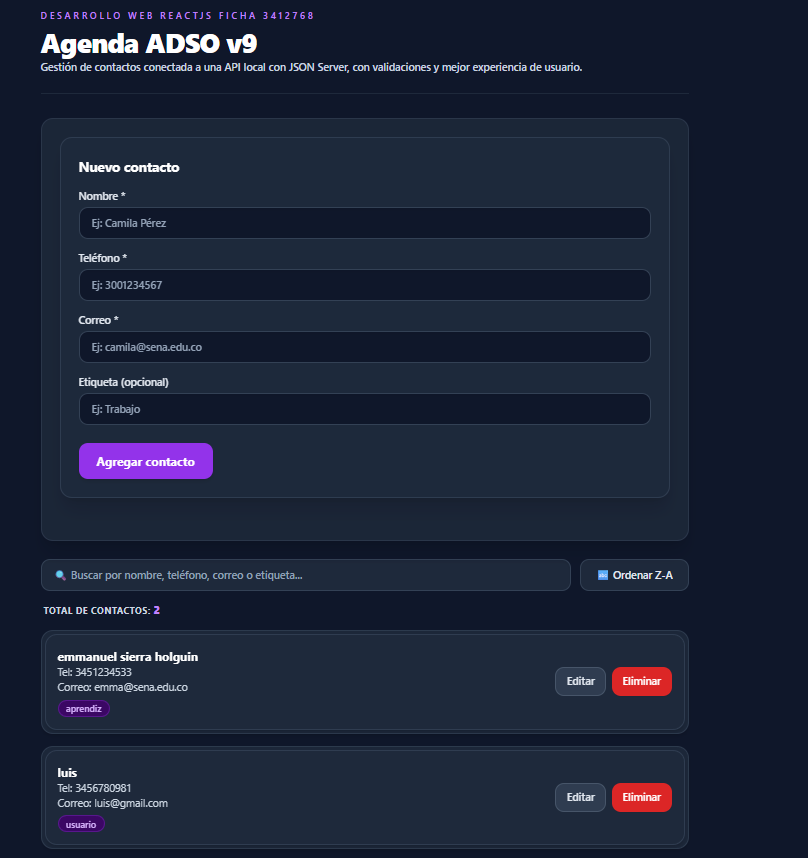
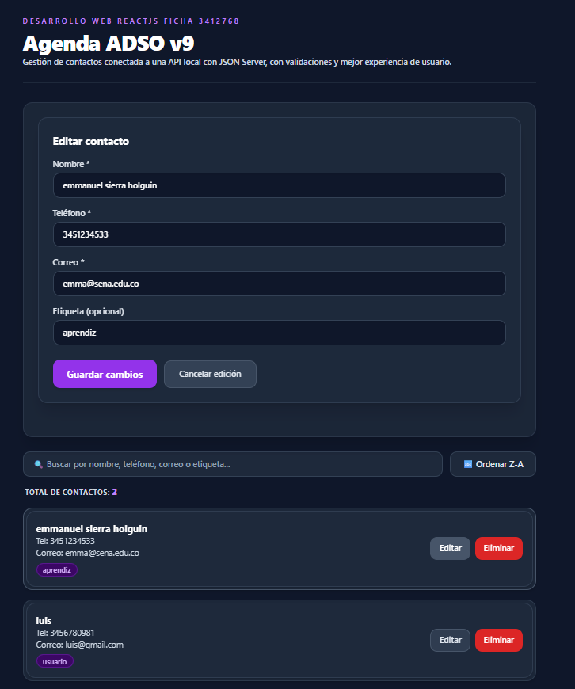
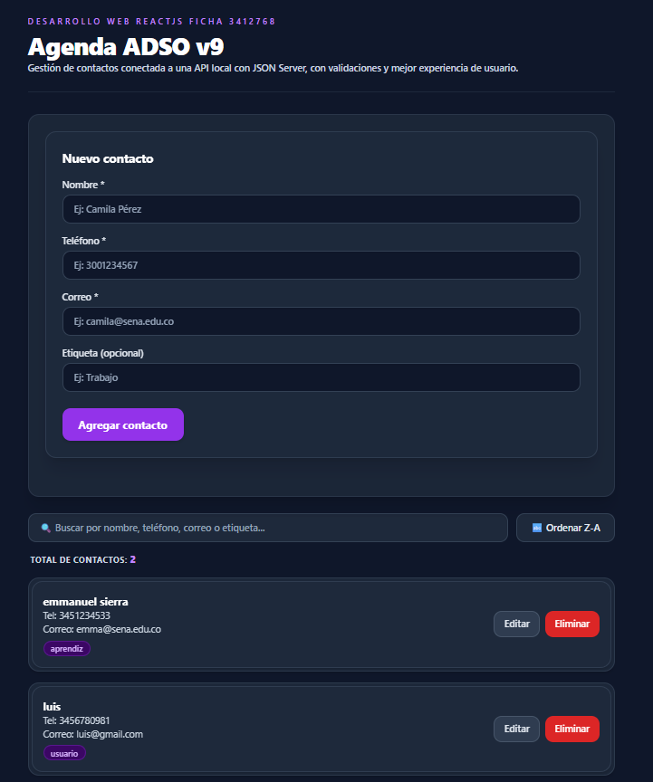

# Agenda ADSO v9 - Gestión de Contactos

Aplicación web desarrollada como parte del ABP (Aprendizaje Basado en Proyectos) para la formación en Análisis y Desarrollo de Software (ADSO) - SENA. Permite gestionar un CRUD completo de contactos con validaciones y estilos modernos.

## 🛠️ Tecnologías Usadas
- **React (Vite):** Biblioteca de JavaScript para la construcción de la interfaz y componentes modulares.
- **Tailwind CSS:** Framework de estilos para el diseño visual adaptable.
- **JSON Server:** Herramienta de desarrollo para simular una API REST backend mediante el archivo `db.json`.
- **Git / GitHub:** Control de versiones y gestión de ramas del proyecto.

## ⚙️ Instrucciones de Instalación y Ejecución

Para clonar y poner en marcha este proyecto en un entorno local, siga estos pasos:

1. **Clonar el repositorio:**
   ```bash
   git clone https://github.com/CorajeEterno/agenda-adso.git
   cd agenda-adso


2. **Instalar las dependencias:**
   Este comando leerá automáticamente el archivo package.json para descargar todas las dependencias y devDependencies necesarias (como React, Tailwind CSS y herramientas de desarrollo):

   **npm install**

   verificar

   **npm list**


3. **Iniciar los servicios locales:**
   El proyecto requiere levantar tanto el entorno de desarrollo del frontend como la base de datos local simulada:

   Encender Vite (Frontend):

   **npm run dev**

   Encender la base de datos (JSON Server / Backend local):

   **npm run start**


## 📸 Evidencias del Proyecto

A continuación se muestra el funcionamiento y diseño de la interfaz en modo oscuro de la **Agenda ADSO v9**:

### 1. Vista Principal (captura1)
> Interfaz general con el formulario de creación vacío, buscador, contador de contactos y el listado de registros.

<p align="center">
  
</p>

### 2. Modo Edición de Contacto (captura2)
> Vista activada al hacer clic en el botón "Editar", la cual rellena automáticamente los campos del formulario con los datos del usuario seleccionado y cambia la acción a "Guardar cambios".

<p align="center">
  
</p>

### 3. Resultados Actualizados (captura3)
> Visualización de la agenda con los cambios guardados y la distribución correcta de las tarjetas de contactos.

<p align="center">
  
</p>

